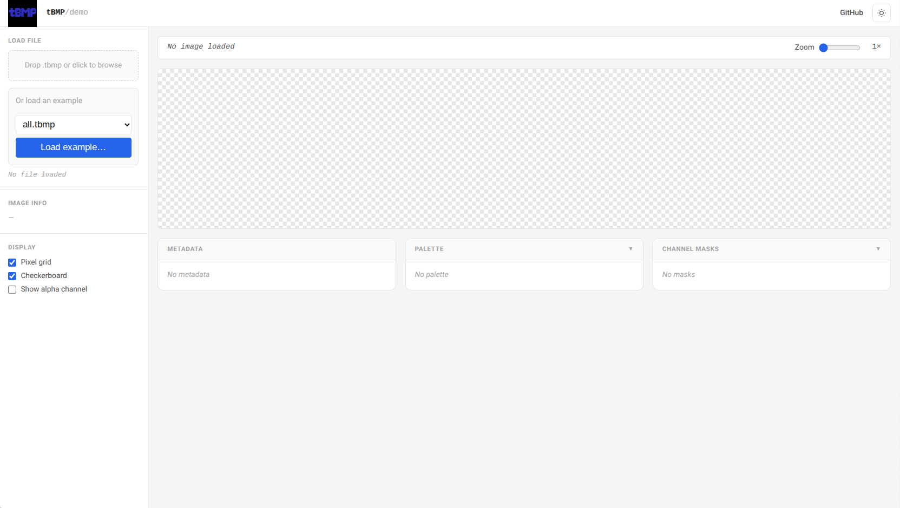
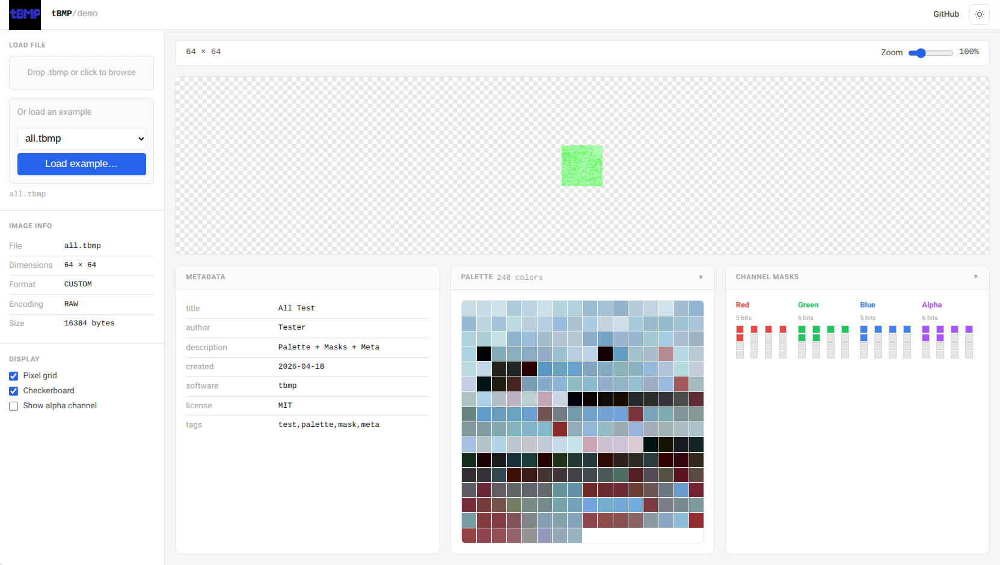
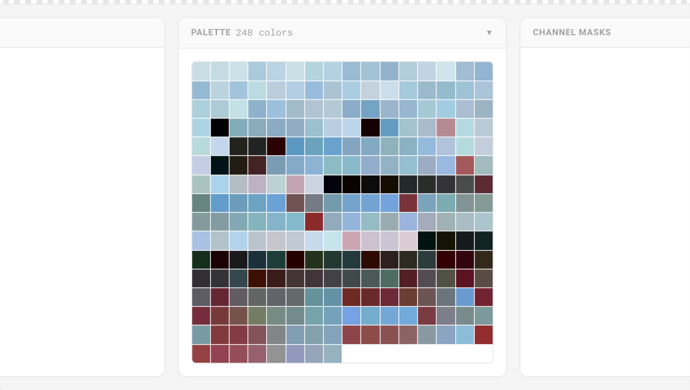
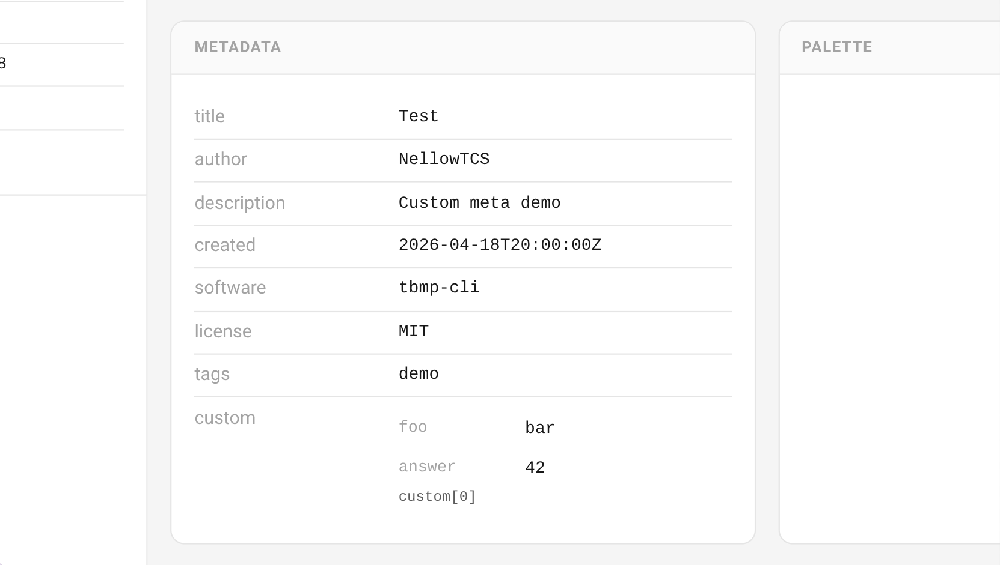
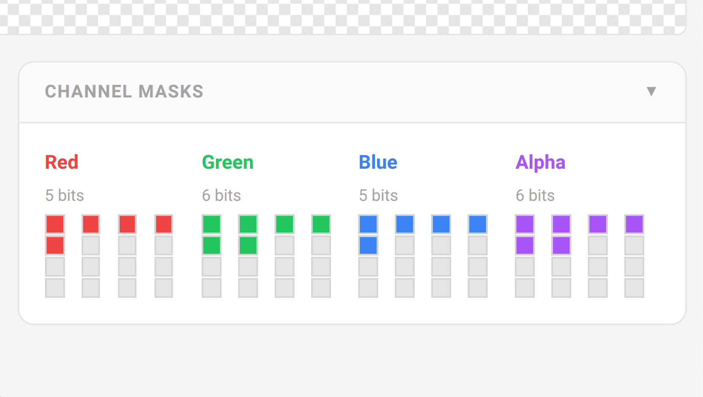

<!-- markdownlint-disable MD033 -->

<p align="center">
    
</p>

**tBMP** (Tiny Bitmap Format) is a binary image format designed for small bitmaps. It gives you multiple encoding options, metadata support, and a zero-dependency C library for reading, writing, and manipulating your images.

::: callout tip
**Try the tBMP Demo!**

Want to see tBMP in action? Check out the interactive [web demo](https://nellowtcs.me/tBMP/)! Load, inspect, and visualize .tbmp files right in your browser. No install needed.
:::

## What it solves

You're working with small images where file size or decode speed matters. Game sprites, embedded UI, firmware assets, the usual suspects. The big image formats drag in dependencies and compression algorithms you don't need.

tBMP keeps it simple: a predictable binary layout, zero external deps, and encodings that actually match your data patterns.

## Features

::: card Multiple Encodings
RAW, RLE, zero-range, span, sparse pixel, and block-sparse. Pick what fits your data best.
:::

::: card Schema-Driven
The format is defined in `tBMP.ksy`. Parse with confidence: the structure is enforced.
:::

::: card Zero Dependencies
Plain C. Link `libtbmp.a` and you're done.
:::

::: card Metadata Built-In
Palettes, pixel masks, and custom metadata chunks when you need them.
:::

## Quick Example

**Read an image:**

```c
#include "tbmp_reader.h"

FILE *input = fopen("sprite.tbmp", "rb");
tbmp_image img;

if (tbmp_read(input, &img)) {
    printf("Loaded %dx%d image\n", img.width, img.height);
}

fclose(input);
```

**Write an image:**

```c
#include "tbmp_write.h"

tbmp_image img = {
    .width = 32,
    .height = 32,
    .encoding = TBMP_ENCODING_RLE,
    .data = pixel_data,
    .data_size = 1024
};

FILE *output = fopen("output.tbmp", "wb");
tbmp_write(output, &img);
fclose(output);
```

That's it. No external libs, no configure scripts.

## tBMP Logo

<p align="center">
    
</p>

The tBMP logo is available as both a PNG and a tBMP file. Use it for badges, splash screens, or to show off your tBMP support!

**Download:**

- [tBMP Logo (.tbmp)](/tBMP/examples/tBMP_Logo.tbmp)
- [tBMP Logo (PNG)](/tBMP/examples/tBMP_Logo.png)

You’ll also see the logo on the [web demo](../../Demo/index.html) and in the README. Feel free to use it in your own projects!

## tBMP Demo

The tBMP web demo lets you load, inspect, and experiment with `.tbmp` files directly in your browser. Below are screenshots highlighting the main features and panels you’ll find in the demo:

<div style="display: grid; grid-template-columns: repeat(auto-fit, minmax(320px, 1fr)); gap: 2em; justify-items: center; align-items: start; margin: 2em 0;">
    <div>
        
        <div style="margin-top:0.5em; text-align:center;"><em><b>Main interface:</b> Clean, user-friendly UI for loading and viewing tBMP images. Drag and drop files, or pick from built-in examples.</em></div>
    </div>
    <div>
        
        <div style="margin-top:0.5em; text-align:center;"><em><b>All panels expanded:</b> See all available information at a glance—pixel data, palette, metadata, and masks.</em></div>
    </div>
    <div>
        
        <div style="margin-top:0.5em; text-align:center;"><em><b>Palette panel:</b> Visualize and inspect the color palette for indexed images. Great for pixel art and retro assets.</em></div>
    </div>
    <div>
        
        <div style="margin-top:0.5em; text-align:center;"><em><b>Metadata panel:</b> View embedded metadata, including custom fields, tags, and extra information stored in the tBMP file.</em></div>
    </div>
    <div>
        
        <div style="margin-top:0.5em; text-align:center;"><em><b>Masks panel:</b> Explore per-channel masks for advanced image effects and transparency.</em></div>
    </div>
</div>

You can try all these features live at the <a href="https://nellowtcs.me/tBMP/" target="_blank">tBMP Web Demo</a>.

## Installation

::: tabs
== tab "Build"

```bash
cmake -B build
cmake --build build
```

The static library is at `build/libtbmp.a`. Include `include/` in your header search path.

:::

## Next Steps

- [Core Concepts](./getting-started/concepts): How the format is structured
- [Quick Start](./getting-started/quickstart): Get up and running in 5 minutes
- [Encoding Guide](./guide/encoding): Pick the right encoding for your data
- [Versioning and Evolution](./guide/versioning): Compatibility rules for future format growth
- [Design Philosophy](./guide/design-philosophy): Why tBMP is intentionally small and explicit
- [tBMP for Embedded Systems](./guide/embedded-systems): Practical guidance for constrained targets
- [tBMP for Games](./guide/games): Asset pipeline and runtime patterns for game projects
- [CLI Guide](./guide/cli): Use the `tbmp` command-line toolkit
- [API Reference](./api/): Full function docs
